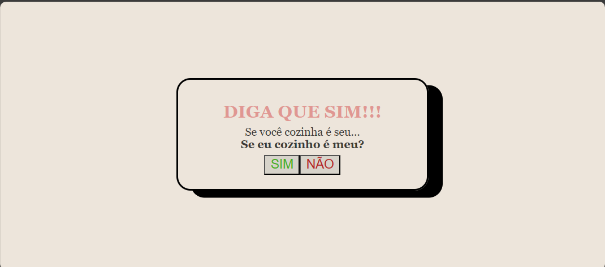

# COZINHO
"Se você cozinha é seu, se eu cozinho é meu?" by Grazy =)
 Teste de aprendizagem DEV WEB com memes. Elementos como Flexbox, CSS Insights, Functions e Alert em JavaScript foram utilizados.

## Table of content
- [Overview](#overview)
  - [Screenshot](#screenshot)
  - [Links](#links)
- [My process](#my-process)
  - [Built with](#built-with)
- [Author](#author)

## Overview
### 📸 Screenshot

This is my template:   
- Responda a box: ⇩

[ACESSE AQUI!!](https://grazysss.github.io/COZINHO/)

## 🔗 Links

- Live URL: [grazymemes.cozinho.com](https://grazysss.github.io/COZINHO/)
- Repository URL: [REPOSITORY GITHUB!!!](https://github.com/grazysss/COZINHO)

## 💡 My process
Build with:
  - HTML
  - CSS
  - Flexbox
  - JavaScript
  - Alert
  - Git 
  - Github

## 💞 Author
- WebSite: [Currículo-Grazys on Github](https://grazysss.github.io/curriculo-grazy/)
- Twitter: [@sz_grazys](https://twitter.com/sz_grays)
- Github: [SIGAM-LÁ!!!](https://github.com/grazysss/)

.

.

.
# FINISH!!! ツ